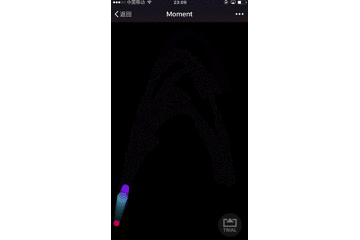
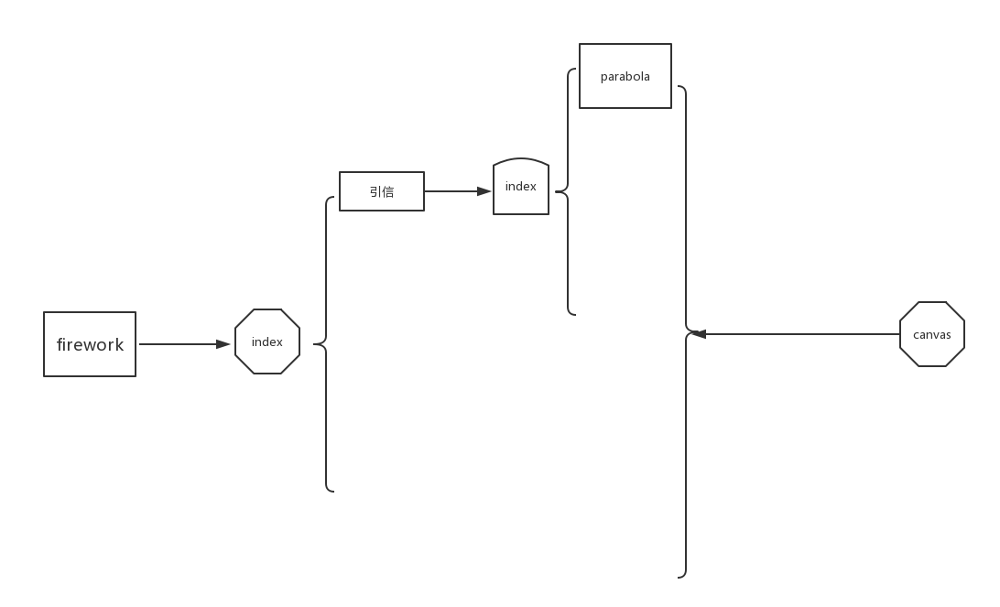

# Moment


# 提交记录

## 2017-08-22 23:19

最近有点忙了，加上一直没好的实现方法了，导致整个项目属于停滞的状态了。这几天也看了下简单工厂模式，感觉可以应用到这个项目上来，晚上突然灵机一动，修改了点代码，使各个功能的代码能自己管理自己，移动，删除的动作都有自己独立完成了

```javascript
this.fireWorks.push({
    status: 0,
    fuses: new Fuse({
        target,
        color
    }),
    explodes: new Explode({
        target,
        color
    })
})
```

增加引信和爆炸的方法现在改成了直接push这两个类了，每个类独立管理自己的状态

```javascript
for (let i = 0, len = fireWorks.length; i < len; i++) {
    let fireWork = fireWorks[i],
        status = fireWork.status;
        if (status == 0) {
            fireWork.fuses.start();
        } else {
            fireWork.explodes.start();
        } 
}
```

绘制的代码也更加清晰，这样改后扩展性强很多了


## 2017-08-12 21:59

这两天实现了爆炸的效果，但是代码被改的不成样了。以前引信和爆炸的逻辑是分开的，现在要把这两者结合的话，以前的结构有点问题，引信和爆炸必须一次次处理了，以前是全部处理了，这部分逻辑应该放到烟花总入口里面去处理。现在的效果还是比较炫的，哈哈。下期整理代码结构了，并且加点概念进去

## 2017-08-10 22:46 

今天把项目搞到github上来了，现在在做烟花引信Fuse模块的工作，引信部分实现了抛物线运动



现在的烟花代码结构



fireworks为烟花主要的入口，后期烟花播放的逻辑是这里控制了，fuse目录为引信部分的配置，index为引信播放的的入口，其中改目录下可配置多种引信播放的方式，现在就是抛物线的方式，然后最底层是canvas，目标是绘图代码全部放到draw这个外层绘制目录下，components目录为react组建了，现在这快的内容还很少，暂时就不讨论了，units目录为存放工具函数和全局函数的地方。


---
这次在实现抛物线的时候，一开始是把b值求出来之后，然后直接套y = a * x^2 + b * x 这个公式算x和y，这样当b值很大的时候，y轴的值会一下子变得很大，然后跑出去了，后来看了下这篇文章[抛物线](http://www.zhangxinxu.com/wordpress/2013/12/javascript-js-%E5%85%83%E7%B4%A0-%E6%8A%9B%E7%89%A9%E7%BA%BF-%E8%BF%90%E5%8A%A8-%E5%8A%A8%E7%94%BB/)后，发现了他这里求抛物线的值都是根据切线来了，这里的原理暂时不懂，先贴上代码


``` javascript
    _setMovePosition() {
        let tangent = 2 * this.a * this.mx + this.b;
        this.mx = this.mx + this.direction * Math.sqrt(this.speed / (tangent * tangent + 1));
        this.my = this.a * this.mx * this.mx + this.b * this.mx;
    }
```

看效果的时候会发现圆球的屁股后面会有一团阴影,这里是设置canvas的全局透明度globalAlpha为0.85，然后每次绘制在离屏canvas上面，接着又绘制回去，就会出现这种效果了，[参考](https://segmentfault.com/a/1190000008560571)


``` javascript
    draw() {
        offscreenContext.globalCompositeOperation = "copy";
        offscreenContext.drawImage(canvas, 0, 0, canvas.width, canvas.height);
        Canvas.clear();
        this._move();
        context.drawImage(offscreenCanvas, 0, 0, canvas.width, canvas.height);
    }
```

---

总结：

> 代码缺少一个体系，感觉不是太牢固。今天在书上看到了游戏引擎和canvas精灵的概念，感觉可以把这套体系加上去，目标是使自己的代码看上去更加坚不可摧


-- 天生我才必有用，千金散尽还复来


## 使用方法
*  npm install
*  npm run dev 本地开发 npm run build 打包
*  localhost:9191 如保证手机和电脑在同一个局域网内手机可通过访问电脑IP事实查看效果

## 技术栈

> php+mysql+react+redux+webpack+es6+canvas

## Moment由来

> 这是我准备用业余毕生时间做的项目，所以必须要有一个响亮的代号。Moment就是这样产生的，烟花很美，但是确实转瞬即逝，所以取名Moment也是希望自己能对现在所做的事情负责，脚踏实地，一步一步的完成这个项目

## 简述

> 一款移动端的烟花系统，听起来很俗，但是这套系统却相当🐂。每个人可以配置自己的专属烟花，然后生成相应的链接或者分享给别人查看。自己生成的烟花可以设置状态公开或者私有，所以就有了烟花使用排行榜，每个人可以使用别人公开的烟花，并可以在上面修改。这款系统的难点在于烟花的可配置，这些天也在恶补canvas的知识，希望自己能把这套系统无论从哪个方面看都做到极致。

